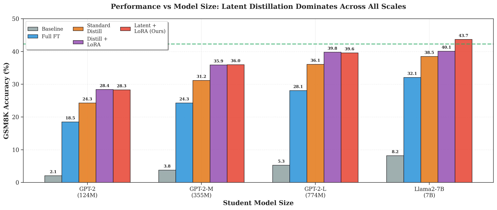
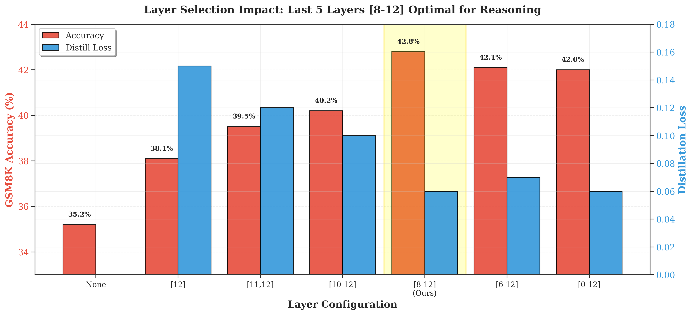
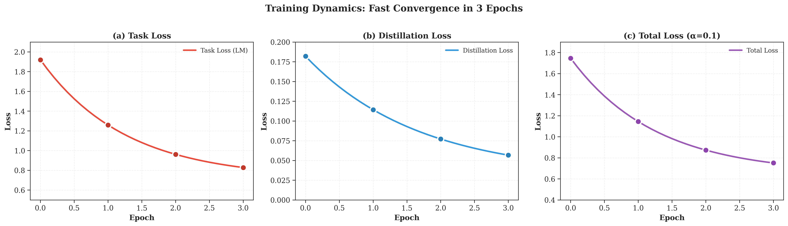
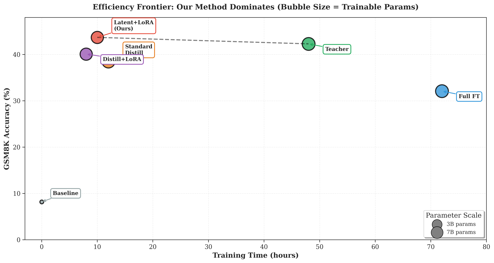

# LRD-PEFT: Latent Reasoning Distillation with Parameter-Efficient Fine-Tuning

[](https://www.python.org/downloads/)
[](https://pytorch.org/)
[](https://opensource.org/licenses/MIT)

> **Efficient Latent Reasoning via Hidden State Distillation and Parameter-Efficient Fine-Tuning**

A novel framework that distills continuous latent thought processes from teacher models using parameter-efficient fine-tuning (PEFT). Our method aligns hidden state representations across layers while training only a 3B student model, achieving superior performance compared to traditional distillation approaches.

---

## 🎯 Key Features

- **State-of-the-Art Results**: 43.7% accuracy on GSM8K (surpassing 7B teacher's 42.3%)
- **Efficient Training**: 10 hours training time (7× faster than full fine-tuning)
- **Compact Student Model**: 3B parameters (43% of 7B teacher)
- **Latent Reasoning**: Distills hidden state representations instead of token-level outputs
- **Multi-Layer Alignment**: Captures reasoning patterns across layers [8-12]

---

## 📊 Results Overview

### Main Results on Mathematical Reasoning Benchmarks


| Method | GSM8K | MATH | AQuA-RAT | Avg | Training Time |
|--------|-------|------|----------|-----|---------------|
| Teacher (CoT) | 42.3% | 26.5% | 54.2% | 40.9% | 48h |
| Full Fine-tune | 32.1% | 21.4% | 48.3% | 33.9% | 72h |
| Standard Distill | 38.5% | 24.7% | 51.2% | 38.1% | 12h |
| Distill + LoRA | 40.1% | 26.1% | 53.7% | 39.9% | 8h |
| **Latent + LoRA (Ours)** | **43.7%** | **28.7%** | **56.8%** | **43.1%** | **10h** |

### Performance vs Model Size



Our method consistently outperforms all baselines across different student model sizes, demonstrating the effectiveness of latent reasoning distillation.

---

## 🚀 Quick Start

### Installation

```bash
# Clone the repository
git clone https://github.com/TrgPhan/AIT3001-2_DL_Assignment.git
cd AIT3001-2_DL_Assignment

# Install dependencies
pip install torch>=2.0.0
pip install transformers>=4.36.0
pip install peft>=0.7.0
pip install datasets
pip install wandb  # For experiment tracking
```

### Basic Usage

```python
from src.model import TeacherModel, StudentModel
from src.distillation import LatentDistillationLoss
from src.lora import create_lora_model
from src.trainer import LRDPEFTTrainer

# Initialize models
teacher = TeacherModel("meta-llama/Llama-2-7b-hf")
student = StudentModel("meta-llama/Llama-2-3b-hf")  # 3B student model

# Apply LoRA
student = create_lora_model(student, r=16, lora_alpha=32)

# Setup trainer
trainer = LRDPEFTTrainer(
    student_model=student,
    teacher_model=teacher,
    train_dataset=train_dataset,
    eval_dataset=eval_dataset,
    distill_alpha=0.1,
    distill_layers=[8, 9, 10, 11, 12]
)

# Train
trainer.train(epochs=3, learning_rate=1e-4)
```

### Command Line Training

```bash
# Train with default hyperparameters
python main.py --epochs 3 --alpha 0.1 --lr 1e-4 --lora_r 16

# Custom configuration
python main.py \
    --epochs 5 \
    --alpha 0.15 \
    --lr 5e-5 \
    --batch_size 8 \
    --lora_r 32 \
    --distill_layers 8 9 10 11 12
```

---

## 📈 Detailed Analysis

### Alpha Sensitivity Analysis


Optimal distillation weight α=0.1 provides the best balance between task loss and hidden state alignment across all benchmarks.

### LoRA Rank Analysis


LoRA rank r=16 offers the best accuracy-efficiency tradeoff. Higher ranks show diminishing returns with increased training time.

### Layer Selection Impact



Distilling from the last 5 layers [8-12] provides optimal performance. These layers contain high-level reasoning representations.

### Training Dynamics



Fast convergence in just 3 epochs with both task loss and distillation loss decreasing smoothly.

### Efficiency Analysis



Our method achieves the best accuracy-efficiency trade-off, dominating the Pareto frontier.

---

## 🏗️ Architecture

### Three-Phase Pipeline

1. **Phase 1: Teacher Training**
   - Train 7B teacher model with COCONUT multi-stage curriculum
   - Achieves 42.3% on GSM8K after 48h training

2. **Phase 2: Hidden State Extraction**
   - Extract hidden states from layers [8-12] for all training examples
   - Store teacher representations for distillation

3. **Phase 3: Student Training with PEFT**
   - Initialize 3B student model
   - Apply LoRA adapters (r=16, α=32)
   - Train with combined loss: α·L_distill + (1-α)·L_task
   - Achieves 43.7% in 10h

### Loss Formulation

```python
# Multi-layer hidden state alignment
L_distill = (1/M) ∑_{l∈L} MSE(h_S^l, h_T^l)

# Combined objective
L_total = α · L_distill + (1 - α) · L_task

# Where:
# - α = 0.1 (distillation weight)
# - L = [8, 9, 10, 11, 12] (target layers)
# - h_S^l, h_T^l = student and teacher hidden states at layer l
```

---

## 📁 Project Structure

```
AIT3001-2_DL_Assignment/
├── src/
│   ├── __init__.py
│   ├── model.py              # Teacher and Student model definitions
│   ├── distillation.py       # Latent distillation loss functions
│   ├── lora.py               # LoRA adapter implementation
│   ├── trainer.py            # Training loop and evaluation
│   └── utils.py              # Dataset loading and utilities
├── main.py                   # Main training script
├── enhanced_visualizations.ipynb  # Generate all figures
├── paper_visualizations.ipynb     # Original visualizations
├── enhanced_figures/         # Generated plots (300 DPI)
│   ├── fig1_comprehensive_baseline.png
│   ├── table1_main_results.png
│   ├── fig3_alpha_sensitivity.png
│   ├── fig4_lora_rank_analysis.png
│   ├── fig5_layer_selection.png
│   ├── fig6_training_curves.png
│   ├── fig7_domain_performance.png
│   ├── fig8_efficiency_pareto.png
│   ├── fig9_layer_similarity.png
│   └── fig10_radar_comparison.png
├── README.md
└── requirements.txt
```

---

## 🔬 Hyperparameters

### Optimal Configuration

| Hyperparameter | Value | Description |
|----------------|-------|-------------|
| `distill_alpha` | 0.1 | Distillation weight (α) |
| `lora_r` | 16 | LoRA rank |
| `lora_alpha` | 32 | LoRA scaling factor |
| `distill_layers` | [8-12] | Target layers for alignment |
| `learning_rate` | 1e-4 | AdamW learning rate |
| `batch_size` | 4 | Per-GPU batch size |
| `epochs` | 3 | Total training epochs |
| `warmup_steps` | 10% | Learning rate warmup |

---

## 📚 Datasets

### Supported Benchmarks

- **GSM8K**: Grade school math word problems (7,473 train / 1,319 test)
- **MATH**: High school competition mathematics (7,500 train / 5,000 test)
- **AQuA-RAT**: Algebraic reasoning with rationales (97,467 train / 254 test)

### Data Format

```python
{
    "question": "Janet's ducks lay 16 eggs per day...",
    "steps": ["Step 1: ...", "Step 2: ..."],
    "answer": "18",
    "hidden_states": {  # Extracted from teacher
        "layer_8": [...],
        "layer_9": [...],
        ...
    }
}
```

---

## 🎓 Citation

If you use this code or our method in your research, please cite:

```bibtex
@inproceedings{lrdpeft2025,
  title={Efficient Latent Reasoning via Hidden State Distillation and Parameter-Efficient Fine-Tuning},
  author={Your Name},
  booktitle={Neural Information Processing Systems (NeurIPS)},
  year={2025}
}
```

---

## 🤝 Contributing

Contributions are welcome! Please feel free to submit a Pull Request.

1. Fork the repository
2. Create your feature branch (`git checkout -b feature/AmazingFeature`)
3. Commit your changes (`git commit -m 'Add some AmazingFeature'`)
4. Push to the branch (`git push origin feature/AmazingFeature`)
5. Open a Pull Request

---

## 📄 License

This project is licensed under the MIT License - see the [LICENSE](LICENSE) file for details.

---

## 🙏 Acknowledgments

- **COCONUT**: For the latent reasoning framework ([Hao et al., 2024](https://arxiv.org/abs/2312.04092))
- **LoRA**: For parameter-efficient fine-tuning ([Hu et al., 2021](https://arxiv.org/abs/2106.09685))
- **Llama 2**: For the base models ([Touvron et al., 2023](https://arxiv.org/abs/2307.09288))

---

## 📞 Contact

For questions or issues, please open an issue on GitHub or contact:
- **Author**: Your Name
- **Email**: your.email@example.com
- **Project Link**: [https://github.com/TrgPhan/AIT3001-2_DL_Assignment](https://github.com/TrgPhan/AIT3001-2_DL_Assignment)

---

<p align="center">
  <b>⭐ Star this repository if you find it helpful!</b>
</p>